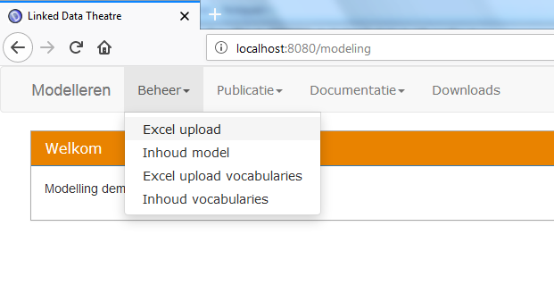

# DCAT profiles

This git repository contains tools for analyzing DCAT profiles. It also contains the results for some well-known profiles:

- DCAT W3c profile, as published at [http://www.w3.org/TR/vocab-dcat/]( http://www.w3.org/TR/vocab-dcat/)
- DCAT AP EU v1.1, as published at [https://joinup.ec.europa.eu/release/dcat-ap-v11](https://joinup.ec.europa.eu/release/dcat-ap-v11)

The final documentation is published at: [http://bp4mc2.org/dcat](http://bp4mc2.org/dcat)

The folders in this repository contain:
- ldt-config: the configuration for the toolset, based on the Linked Data Theatre
- dcat-w3c: all files about the DCAT W3c profile;
- dcat-ap-eu: alle files about the DCAT AP EU v1.1 profile

The profile folders contain at least the following files:
- An Excel file containing the specification in a format that can be automatically translated to SHACL linked Data specification;
- A turtle file containing the generated SHACL specification for the profile;
- A graphml file containing a generated model (diagram) from the SHACL specification (kind of resembling a UML class diagram);
- A png file with a bitmap version of the diagram;
- A markdown file containing the documentation for the specification.

## Using the toolset
Please go to the home page of the toolset (for example: http://localhost:8080/modeling).

Upload the Excel file found in one of the profile folders:

## Installing a local version of the toolset
To create your own toolset, you need to install your own version of the Linked Data Theatre, and you need to install a triple store.

See: [https://github.com/architolk/Linked-Data-Theatre](https://github.com/architolk/Linked-Data-Theatre) for detailed instructions.